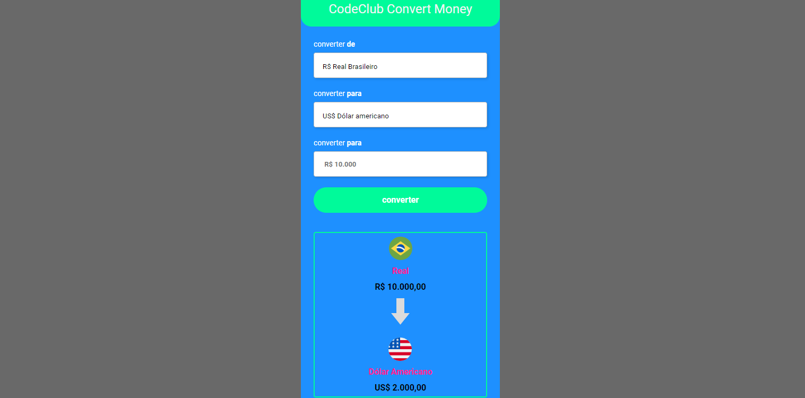

# convesor-de-moedas

  

# Sobre o projeto
- Projeto realizado visando praticar e evoluir meu conhecimento em JavaScript

# Tecnologias utilizadas

 
  
  
  

## Front end
- HTML
- CSS
- JS
## Deploy do projeto
- <a href="https://convesor-de-moedas.vercel.app/">Vercel</a>

# Autor

Danilo Souza

  

